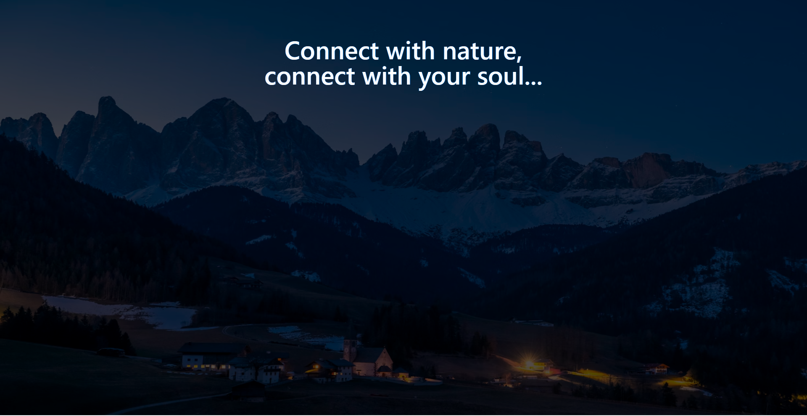

# tailwind css project

````md
# Nature Landing Page

A simple responsive landing page built with **HTML** and **Tailwind CSS**.  
This page features a fullscreen hero section with a background image overlay and centered motivational text.

---

## Features

- Fullscreen hero layout
- Responsive typography for mobile and desktop
- Tailwind CSS styling via CDN
- Background image with blend overlay effect
- Minimal and clean design

---

[live@](https://jishnusmanoj2004-gif.github.io/mix-blend/)



## Technologies Used

- HTML5
- Tailwind CSS (CDN)

---

## Project Structure

```bash
project-folder/
│── index.html
│── README.md
````

---

## How to Run

1. Download or copy the code into an `index.html` file.
2. Open the file in any modern browser.

---

## CDN Used

```html
<script src="https://cdn.jsdelivr.net/npm/@tailwindcss/browser@4"></script>
```

---

## Customization

### Change Background Image

Replace the image URL inside:

```html

```

### Change Text

Edit:

```html
<h1>Connect with nature,</h1>
<p>connect with your soul...</p>
```

---

## Responsive Design

* Mobile: `text-3xl`
* Desktop: `md:text-6xl`

---

## Preview

A dark themed fullscreen hero section with centered inspirational text over a scenic background image.

---


